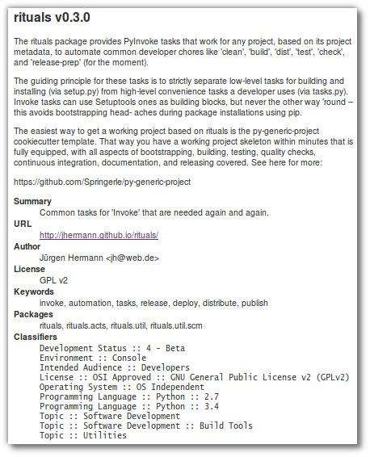

..  documentation: tasks

    Copyright ⓒ  2015 Jürgen Hermann

    This program is free software; you can redistribute it and/or modify
    it under the terms of the GNU General Public License version 2 as
    published by the Free Software Foundation.

    This program is distributed in the hope that it will be useful,
    but WITHOUT ANY WARRANTY; without even the implied warranty of
    MERCHANTABILITY or FITNESS FOR A PARTICULAR PURPOSE.  See the
    GNU General Public License for more details.

    You should have received a copy of the GNU General Public License along
    with this program; if not, write to the Free Software Foundation, Inc.,
    51 Franklin Street, Fifth Floor, Boston, MA 02110-1301 USA.

    The full LICENSE file and source are available at
        https://github.com/jhermann/rituals
    ~~~~~~~~~~~~~~~~~~~~~~~~~~~~~~~~~~~~~~~~~~~~~~~~~~~~~~~~~~~~~~~~~~~~~~~~~~~

Tasks Reference
===============

Please make sure you also read the section on :ref:`task-namespaces`.

-----------------------------------------------------------------------------
Fundamental Tasks
-----------------------------------------------------------------------------

Getting Help
^^^^^^^^^^^^

``help`` is the default task in the root namespace, so that just calling ``inv``
gives a reasonable response. It combines the global help (``inv -h``) and the
task listing (``inv -l``).

Project Cleanup
^^^^^^^^^^^^^^^

The ``clean`` task gets rid of various groups of generated files,
selectable by options. These options are::

    -a, --all        The same as --backups --bytecode --dist --docs
    -b, --backups    Also clean '*~' files etc.
    -d, --docs       Also clean the documentation build area
    -e, --extra      Any extra patterns, space-separated and possibly quoted
    -i, --dist       Also clean the 'dist' dir
    -t, --tox        Include '.tox' directory
    -v, --venv       Include an existing virtualenv (in '.' or in '.venv')
    -y, --bytecode   Also clean '.pyc', '.pyo', and package metadata

Note that ``--all`` is selective and only cleans out ‘cheap’ files;
it especially excludes a local virtualenv that carries state (installed packages)
you might not have recorded safely in requirements files yet, and the
tree generated by ``tox`` that can take a while to reproduce.

The ``--extra`` options allows you to add any custom glob patterns to clean out.

Building the Project
^^^^^^^^^^^^^^^^^^^^

Invoking ``build`` just delegates to ``setup.py`` right now.
In the future, automatic detection of other project components
like a Maven POM or Javascript build files might trigger additional build tools.

You can also include the ``docs`` task by adding the ``--docs`` option.

Freezing Requirements
^^^^^^^^^^^^^^^^^^^^^

Calling ``freeze`` writes the frozen requirements as found in the current environment
into the file ``frozen-requirements.txt``, by calling ``pip freeze``.

-----------------------------------------------------------------------------
Executing Tests
-----------------------------------------------------------------------------

The ``test.pytest`` and ``test.tox`` tasks call the related testing tools with
appropriate parameters. Coverage configuration is added to the ``py.test`` call,
and if you pass the ``--coverage`` option, the generated report is loaded into
your web browser. In case the ``py.test`` command isn't available, calling the
test runner is delegated to ``setup.py``.

For ``test.tox``, ``PATH`` is extended according to the directories in the
``rituals.snakepits`` configuration value, which defaults to
``/opt/pyenv/bin:/opt/pyrun/bin``. That way, you can provide the *Python*
interpreter versions to run multi-environment tests locally.

-----------------------------------------------------------------------------
Documentation Tasks
-----------------------------------------------------------------------------

.. _doc-sphinx:

Building Sphinx Documentation
^^^^^^^^^^^^^^^^^^^^^^^^^^^^^

*Rituals* provides automatic process management of a ``sphinx-autobuild``
daemon, which means you easily get a live-reload preview in your browser.
To start the build watchdog, use ``inv docs -w -b``.
The ``-b`` means to open a new browser tab,
after the server process is ready.
To kill the server, call the ``inv docs -k`` command.
You can check on the status of a running daemon with ``inv docs -s``.

Note that sometimes you have to manually trigger a full rebuild via
``inv docs --clean``, especially when you make structural changes
(e.g. adding new chapters to the main toc-tree).
Your browser will change the view to an empty canvas, just
initiate a reload (``Ctrl-R``) when the build is done.
Typically this is needed when the sidebar TOC is out of sync, which happens
due to the optimizations in ``sphinx-autobuild`` that make it so responsive.

Publishing Documentation
^^^^^^^^^^^^^^^^^^^^^^^^

To upload documentation to either PyPI or a WebDAV server (like *Artifactory*),
you can use the ``docs.upload`` tasks after using ``docs.sphinx``. By default,
the `documentation hosting of PyPI <http://pythonhosted.org/>`_ is used.

To enable a local documentation server, set the following environment variables (e.g. in your ``~/.bashrc``)::

    export INVOKE_RITUALS_DOCS_UPLOAD_METHOD=webdav
    export INVOKE_RITUALS_DOCS_UPLOAD_TARGETS_WEBDAV_URL='http://repo.example.com/artifactory/wwwdata-local/python/{name}/{version}/{name}-{version}.zip;kind=docs'

This example shows a configuration for an Artifactory server, and as you can see
the ``name`` and ``version`` of the project can be used to generate appropriate URLs.
The version defaults to ``latest``, unless you provide a specific version number via the ``--release`` option.
To use the upload in a browser, add ``!/index.html`` to the URL of the ZIP file,
and make sure the configuration of your Artifactory installation correctly handles
image and other relevant MIME types.

Note that you can override the default upload method using the ``target`` option,
i.e. adding ``--target pypi`` to your task invocation will upload the docs to PyPI no matter what.

.. note::

    The WebDAV upload is tested with Artifactory 4.x, if you encounter problems with
    other repository servers, open a ticket so support for them can be added.

-----------------------------------------------------------------------------
Release Workflow
-----------------------------------------------------------------------------

.. _release-bump:

Managing Development Versions
^^^^^^^^^^^^^^^^^^^^^^^^^^^^^

For intermediate test releases, you can automatically generate a dev version
compliant to  `PEP-440`_.
The ``release.bump`` task generates this version, and rewrites the ``tag_build``
value in ``setup_cfg``.
For this to work, the config file must already exists, and contain a line with
an existing ``tag_build`` setting, like this:

.. code-block:: ini

    [egg_info]
    tag_build = .dev
    tag_date = false

The created version strives to uniquely describe the code being packaged,
so it can get quite lengthy.
The “worst case scenario” when it comes to length looks like this:
``1.2.2.dev4+1.2.1.g07c5047.20170309t1247.ci.42``.

Let's dissect this:

* ``1.2.2`` is the next-release version as reported by ``setup.py``.
* ``.dev4`` means we are 4 commits beyond the last release version.
* ``1.2.1`` is that last release version, found via checking the annotated ``git`` tags.
* ``g07c5047`` is the ``git`` commit hash of the ``HEAD`` ref.
* Having the ``20170309t1247`` timestamp means the working directory at the time of the task execution was dirty (had uncommitted changes).
* ``ci.42`` is appended when the environment contains a ``BUILD_ID`` variable (in this case, set to ``42``).

Use the ``--pypi`` option to prevent creation of the local part of the version info
(anything after the ``+``). This allows you to push development versions to PyPI
for open beta release testing. In those cases, you should commit ``setup.cfg``
with the specific ``tag_build`` setting, and then ``git tag`` that commit.

Adding ``-v`` for verbosity shows a few more details of assembling the version
information. Right now, only ``git`` is really supported regarding SCM metadata.
Anything else will give you ``Unsupported SCM`` warnings when using this and some
other tasks.

.. _`PEP-440`: https://www.python.org/dev/peps/pep-0440/

.. _release-prep:

Preparing a Release
^^^^^^^^^^^^^^^^^^^

``release.prep`` performs QA checks, and switches to non-dev versioning.

**TODO**

.. _release-zipapp:

Building a ZipApp Distribution
^^^^^^^^^^^^^^^^^^^^^^^^^^^^^^

Using PEX or shiv…

**TODO**

You can also directly upload the created artifact to a (local) repository
by passing the :option:`--upload` option to ``release.pex`` or ``release.shiv``.
It has to support PUT requests – e.g. any WebDAV server can be used as a target.
The default path used is ``{name}/{fullversion}/{filename}``, and
you must add the base URL of your repository server to your environment like this::

    export INVOKE_RITUALS_RELEASE_UPLOAD_BASE_URL=http://artifactory.local/artifactory/pypi-releases-local/

Add that line to one of your shell's configuration files, e.g. ``~/.bashrc``.

If you want to release a zipapp publically, either use ``twine`` to upload to PyPI,
or some tool to upload to services like GitHub (e.g. `githubrelease asset`_), GitLab, or Bintray.

.. _`githubrelease asset`: https://github.com/j0057/github-release#readme

-----------------------------------------------------------------------------
Continuous Integration
-----------------------------------------------------------------------------

Jenkins
^^^^^^^

Note that tasks related to *Jenkins* are only available by default when the
environment variable ``JENKINS_URL`` is defined.

The ``jenkins.description`` task creates a text file (by default ``build/project.html``) that can be used via the
`Jenkins Description Setter`_ plugin to dynamically fill the Jenkins job description from already available metadata.
The resulting description looks like the example on the right.

.. _`Jenkins Description Setter`: https://wiki.jenkins-ci.org/display/JENKINS/Description+Setter+Plugin
